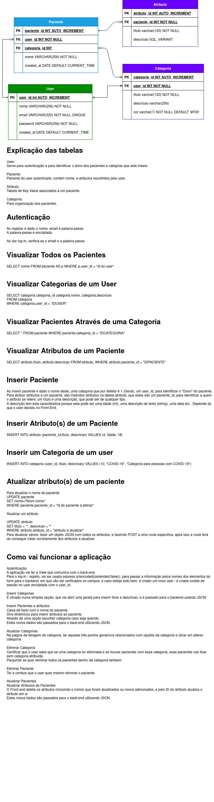

# Definicao de objetivos

- [x] Servidor
- [x] Autenticacao (cookie de sessao)
- [ ] Routes de funcionalidade
  - [x] Listar Categorias
  - [x] Listar Todos Os Pacientes
  - [x] Inserir Categorias
  - [ ] Listar Pacientes Ao Clicar Categoria
  - [ ] Visualizar um Paciente
  - [ ] Inserir Paciente
- [ ] UX/UI
- [ ] Atualizar README
  - [ ] Descrever objetivos
  - [ ] Dificuldades encontradas
  - [ ] O que irei aprendi e o que vou aprimorar no futuro
  - [ ] Outros

## Modelo de dados

